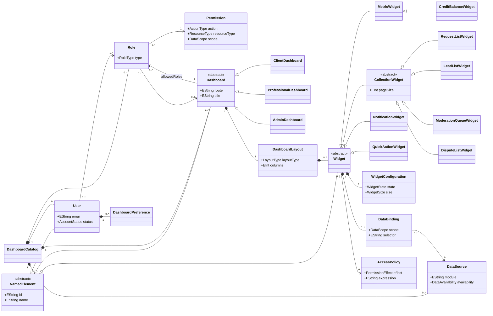

# Role-Based Dashboard — Ecore structure

This is a **readable conceptual subset** of the full `.ecore` model (35 classes). The `.ecore` file is authoritative for types and multiplicities.

```mermaid
classDiagram
  direction LR
  class NamedElement {
    <<abstract>>
    +EString id
    +EString name
  }
  class DashboardCatalog
  class User {
    +EString email
    +AccountStatus status
  }
  class Role {
    +RoleType type
  }
  class Permission {
    +ActionType action
    +ResourceType resourceType
    +DataScope scope
  }
  class Dashboard {
    <<abstract>>
    +EString route
    +EString title
  }
  class ClientDashboard
  class ProfessionalDashboard
  class AdminDashboard
  class DashboardLayout {
    +LayoutType layoutType
    +EInt columns
  }
  class Widget {
    <<abstract>>
  }
  class MetricWidget
  class CollectionWidget {
    <<abstract>>
    +EInt pageSize
  }
  class RequestListWidget
  class LeadListWidget
  class ModerationQueueWidget
  class DisputeListWidget
  class CreditBalanceWidget
  class NotificationWidget
  class QuickActionWidget
  class WidgetConfiguration {
    +WidgetState state
    +WidgetSize size
  }
  class DataBinding {
    +DataScope scope
    +EString selector
  }
  class DataSource {
    +EString module
    +DataAvailability availability
  }
  class AccessPolicy {
    +PermissionEffect effect
    +EString expression
  }
  class DashboardPreference
  NamedElement <|-- User
  NamedElement <|-- Dashboard
  NamedElement <|-- Widget
  Dashboard <|-- ClientDashboard
  Dashboard <|-- ProfessionalDashboard
  Dashboard <|-- AdminDashboard
  Widget <|-- MetricWidget
  Widget <|-- CollectionWidget
  Widget <|-- NotificationWidget
  Widget <|-- QuickActionWidget
  MetricWidget <|-- CreditBalanceWidget
  CollectionWidget <|-- RequestListWidget
  CollectionWidget <|-- LeadListWidget
  CollectionWidget <|-- ModerationQueueWidget
  CollectionWidget <|-- DisputeListWidget
  DashboardCatalog "1" *-- "0..*" User
  DashboardCatalog "1" *-- "0..*" Role
  DashboardCatalog "1" *-- "0..*" Dashboard
  DashboardCatalog "1" *-- "0..*" DataSource
  User "0..*" --> "1..*" Role
  Role "0..*" --> "0..*" Permission
  Role "0..*" --> "0..1" Dashboard
  Dashboard "1" --> "1..*" Role : allowedRoles
  Dashboard "1" *-- "1" DashboardLayout
  DashboardLayout "1" *-- "0..*" Widget
  Widget "1" *-- "1" WidgetConfiguration
  Widget "1" *-- "0..1" DataBinding
  DataBinding "0..*" --> "1" DataSource
  Widget "0..*" --> "0..*" AccessPolicy
  User "1" *-- "0..*" DashboardPreference
```
