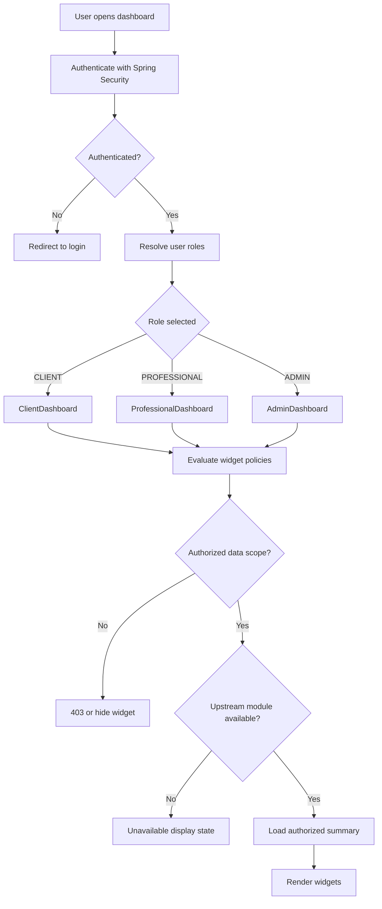
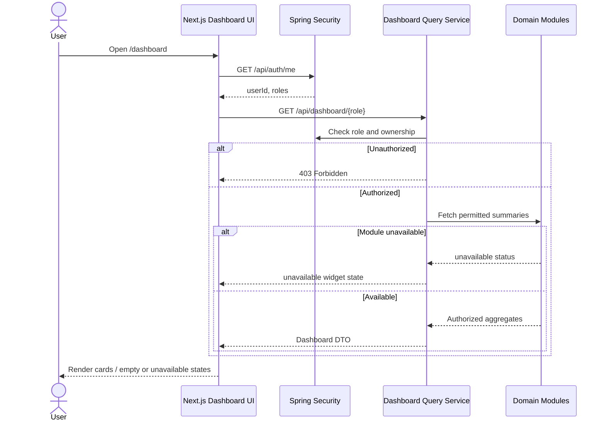
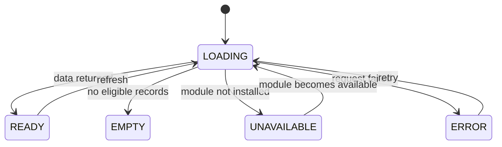
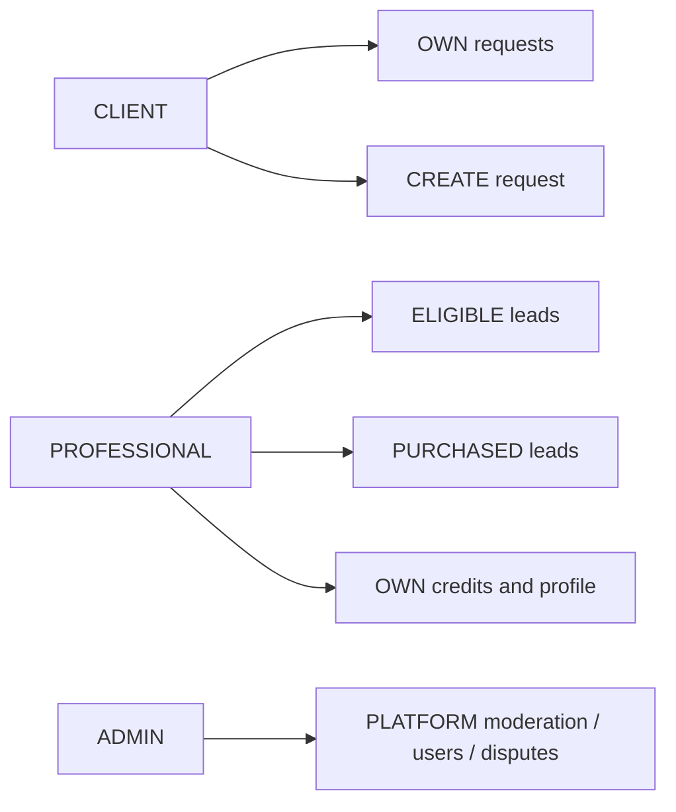

# Runtime flows 

## Role-based access and loading

```mermaid
flowchart TD
  A[User opens dashboard] --> B[Authenticate with Spring Security]
  B --> C{Authenticated?}
  C -->|No| L[Redirect to login]
  C -->|Yes| D[Resolve user roles]
  D --> E{Role selected}
  E -->|CLIENT| F[ClientDashboard]
  E -->|PROFESSIONAL| G[ProfessionalDashboard]
  E -->|ADMIN| H[AdminDashboard]
  F --> I[Evaluate widget policies]
  G --> I
  H --> I
  I --> J{Authorized data scope?}
  J -->|No| X[403 or hide widget]
  J -->|Yes| K{Upstream module available?}
  K -->|No| M[Unavailable display state]
  K -->|Yes| N[Load authorized summary]
  N --> O[Render widgets]
```

## Dashboard rendering sequence

```mermaid
sequenceDiagram
  actor User
  participant UI as Next.js Dashboard UI
  participant Auth as Spring Security
  participant API as Dashboard Query Service
  participant Module as Domain Modules
  User->>UI: Open /dashboard
  UI->>Auth: GET /api/auth/me
  Auth-->>UI: userId, roles
  UI->>API: GET /api/dashboard/{role}
  API->>Auth: Check role and ownership
  alt Unauthorized
    API-->>UI: 403 Forbidden
  else Authorized
    API->>Module: Fetch permitted summaries
    alt Module unavailable
      Module-->>API: unavailable status
      API-->>UI: unavailable widget state
    else Available
      Module-->>API: Authorized aggregates
      API-->>UI: Dashboard DTO
    end
  end
  UI-->>User: Render cards / empty or unavailable states
```

## Widget display states

```mermaid
stateDiagram-v2
  [*] --> LOADING
  LOADING --> READY: data returned
  LOADING --> EMPTY: no eligible records
  LOADING --> UNAVAILABLE: module not installed
  LOADING --> ERROR: request failed
  READY --> LOADING: refresh
  ERROR --> LOADING: retry
  UNAVAILABLE --> LOADING: module becomes available
```

## Roles and data scopes

```mermaid
flowchart LR
  Client[CLIENT] --> Own[OWN requests]
  Client --> Create[CREATE request]
  Professional[PROFESSIONAL] --> Eligible[ELIGIBLE leads]
  Professional --> Purchased[PURCHASED leads]
  Professional --> Credits[OWN credits and profile]
  Admin[ADMIN] --> Platform[PLATFORM moderation / users / disputes]
```
